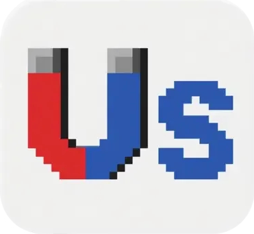

# Us - 情感社交平台

<div align="center">
  

  **Us is many U, U belong to Us**

  *一个温暖的情感社交平台，让每个"你"都能找到属于自己的"我们"*

  [](https://github.com/Domy-MANS/Us/stargazers)
  [](https://github.com/Domy-MANS/Us/network)
  [](https://github.com/Domy-MANS/Us/blob/main/LICENSE)
  
  

  [🚀 立即体验](https://domy-mans.github.io/Us/Us.html) | [🤖 AI聊天](https://domy-mans.github.io/Us/UsBot/) | [⬇️ 下载使用](https://github.com/Domy-MANS/Us/archive/refs/heads/main.zip) | [📖 使用指南](#-使用指南)
</div>

## 🌟 项目理念

**Us** 这个名字巧妙地利用了英语复数的概念：很多个 **U**（你）聚在一起，形成了 **Us**（我们）。这体现了平台的核心理念——将孤独的个体连接成温暖的群体。

## ⚡ Fun Fact

> 🚀 **令人震惊的开发速度**：整个Us项目（包括前端界面、AI聊天系统、数据分析、可视化图表、6个服务模块以及完整文档）由一个人在**不到一周**的时间内独立完成！
>
> 📅 **开发时间线**：
> - 🎯 产品设计与架构规划
> - 🌐 前端界面开发与交互实现
> - 🤖 AI聊天系统集成（Ollama + 多模型支持）
> - 📊 用户行为追踪与数据收集
> - 📈 数据分析与可视化系统
> - 🔧 6个独立服务模块的开发与整合
> - 📝 完整的项目文档与部署配置
>
> 💡 这展现了快速原型开发、全栈技术整合和高效执行的能力！

## ✨ 主要功能

### 🎯 **FindUs - 个性化群体推荐**
- 基于年龄、性别、MBTI、职业等信息
- 智能推荐合适的 "Us" 群体
- 支持创建自定义群体
- 精准匹配志同道合的伙伴

### 💝 **SeeU - 情感分享与支持**
- 三种情感类型：😭 悲伤/孤独、😎 快乐/积极、😟 焦虑/困惑
- 群体内情感分享和互动
- 点赞、评论、情感反馈系统
- 真实的情感表达和共鸣空间

### 🤖 **HelpU - AI 情感伙伴 UsBot**
- 24/7 情感支持聊天机器人
- 双语支持（中文/英文）
- 本地 AI 模型，保护隐私
- 可拖拽的情感反应伴侣

### 📊 **用户行为分析**
- 实时用户行为追踪
- 情感状态分析
- 数据可视化图表
- 个人和群体统计报告

## 🏗️ 技术架构

### 前端
- **纯 HTML/CSS/JavaScript** - 轻量级单页应用
- **响应式设计** - 适配各种设备
- **实时交互** - 流畅的用户体验
- **三大核心模块**：FindUs（群体推荐）、SeeU（情感分享）、HelpU（AI聊天）

### 核心服务模块
Us项目包含6个主要功能模块：

| 模块 | 文件 | 功能描述 |
|------|------|----------|
| 🌐 **本地服务器** | `npx http-server` | 提供Web服务，访问Us.html主界面 |
| 📝 **用户日志** | `us-log-server.js` | 记录用户行为数据到real_data文件夹 |
| 🤖 **AI聊天服务** | `us-ai-server/server.js` | 基于Ollama的本地AI聊天功能 |
| 🎲 **假数据生成** | `generate-fake-logs.js` | 生成测试数据到fake_data文件夹 |
| 📊 **真实数据分析** | `analyze-log.js` | 分析real_data，生成用户统计报告 |
| 📈 **假数据分析** | `analyze-fake-log.js` | 分析fake_data，生成测试统计报告 |

### AI 模型
- **Qwen2:1.5b** - 中文对话优化
- **Llama3.2:1b** - 英文对话支持
- **智能降级** - 多重备选方案

## 🚀 快速体验

### 🌟 方式1：在线体验（推荐）
> 无需下载，直接在浏览器中使用

- **主页**：[https://domy-mans.github.io/Us/](https://domy-mans.github.io/Us/)
- **Us应用**：[https://domy-mans.github.io/Us/Us.html](https://domy-mans.github.io/Us/Us.html)
- **AI聊天**：[https://domy-mans.github.io/Us/UsBot/](https://domy-mans.github.io/Us/UsBot/)

### 📥 方式2：下载体验
> 适合想要本地运行的用户

1. **下载项目**
   - [点击下载ZIP文件](https://github.com/Domy-MANS/Us/archive/refs/heads/main.zip)
   - 或使用Git：`git clone https://github.com/Domy-MANS/Us.git`

2. **解压并打开**
   - 解压下载的文件
   - 双击打开 `Us.html` 文件
   - 开始使用！

### 🔧 完整安装（开发者）

如果你想要完整的AI功能和数据分析：

#### 环境要求
- Node.js 14+
- Python 3.7+ (用于数据分析)
- Ollama (本地 AI 模型)

#### 安装步骤

1. **克隆项目**
```bash
git clone https://github.com/Domy-MANS/Us.git
cd Us
```

2. **安装 AI 服务依赖**
```bash
cd us-ai-server
npm install
cd ..
```

3. **安装 Ollama 和 AI 模型**（可选，用于AI聊天功能）
```bash
# 安装 Ollama
brew install ollama

# 下载 AI 模型
ollama pull qwen2:1.5b
ollama pull llama3.2:1b
```

#### 🚀 启动服务

Us项目包含多个服务，根据需要启动：

| 服务 | 命令 | 端口 | 功能 |
|------|------|------|------|
| **本地服务器** | `npx http-server . -p 1234` | 1234 | 启动本地服务器访问Us.html |
| **用户日志服务** | `node us-log-server.js` | 4000 | 记录用户行为到real_data |
| **AI聊天服务** | `cd us-ai-server && node server.js` | 3000 | AI聊天功能 |

#### 📊 数据分析工具

| 工具 | 命令 | 功能 |
|------|------|------|
| **生成假数据** | `node generate-fake-logs.js` | 生成测试数据到fake_data文件夹 |
| **分析真实数据** | `node analyze-log.js` | 分析real_data，生成统计报告 |
| **分析假数据** | `node analyze-fake-log.js` | 分析fake_data，生成统计报告 |

#### 🎯 推荐启动流程

**基础使用**（仅体验界面）：
```bash
cd Us
npx http-server . -p 1234
# 浏览器访问: http://localhost:1234/Us.html
```

**完整功能**（包含AI和数据记录）：
```bash
# 终端1: 启动本地服务器
cd Us
npx http-server . -p 1234

# 终端2: 启动日志服务
cd Us
node us-log-server.js

# 终端3: 启动AI服务
cd Us/us-ai-server
node server.js

# 浏览器访问: http://localhost:1234/Us.html
```

## 📱 使用指南

### 🎯 快速上手
1. **注册信息** - 填写年龄、性别、MBTI 等基本信息
2. **FindUs** - 通过智能推荐加入合适的 "Us" 群体或创建自定义群体
3. **SeeU** - 在群体中分享你的感受和想法，获得情感支持
4. **HelpU** - 点击 "Help U" 与 UsBot 进行24/7情感支持对话
5. **查看统计** - 了解自己的使用习惯和情感变化

### 📸 项目截图
> 项目界面预览，让你快速了解Us的功能

- 主界面展示了群体推荐和情感分享功能
- UsBot提供24/7情感支持聊天
- 数据分析页面显示详细的使用统计
- 支持中英文双语切换

*注：完整的项目截图可在 [supplement/Us_pic](./supplement/Us_pic) 文件夹中查看*

## 🎨 项目特色

- **🔒 隐私保护** - 本地 AI 模型，数据不上传
- **💰 完全免费** - 无需 API 费用，本地运行
- **🌍 双语支持** - 中英文智能切换
- **📈 数据驱动** - 详细的用户行为分析
- **🎭 情感智能** - 理解和回应用户情感需求
- **⚡ 快速开发** - 不到一周完成全栈开发，展现高效执行力

## 📊 数据分析功能

项目包含完整的数据分析系统：
- **用户行为统计** - 记录和分析用户操作
- **情感趋势分析** - 追踪情感状态变化
- **群体活跃度报告** - 分析群体互动数据
- **可视化图表生成** - 生成PNG图表和CSV/JSON报告

### 数据文件结构
```
├── real_data/          # 真实用户数据
│   ├── logs.json       # 用户行为日志
│   └── *.csv          # 统计报告
├── fake_data/          # 测试数据
│   ├── logs_fake.json  # 模拟用户日志
│   └── *.png          # 可视化图表
```

## 🔧 故障排除

### 常见问题解决

**Q: AI聊天不工作？**
- 确保已安装Ollama：`brew install ollama`
- 下载AI模型：`ollama pull qwen2:1.5b`
- 检查AI服务是否启动：`cd us-ai-server && node server.js`

**Q: 页面无法加载？**
- 使用本地服务器：`npx http-server . -p 1234`
- 访问：`http://localhost:1234/Us.html`

**Q: 数据分析报错？**
- 确保有数据文件：先运行`node generate-fake-logs.js`生成测试数据
- 检查Python环境：数据分析需要Python 3.7+

**Q: 端口被占用？**
- 修改端口：`npx http-server . -p 8080`（使用其他端口）
- 检查端口占用：`lsof -i :1234`

## 🤝 贡献指南

欢迎贡献代码、报告问题或提出建议！

1. Fork 项目
2. 创建功能分支 (`git checkout -b feature/AmazingFeature`)
3. 提交更改 (`git commit -m 'Add some AmazingFeature'`)
4. 推送到分支 (`git push origin feature/AmazingFeature`)
5. 打开 Pull Request

## 📄 许可证

本项目采用 MIT 许可证 - 查看 [LICENSE](LICENSE) 文件了解详情

## 👨‍💻 作者

**Domy Yu (于梓方)**
- 🚀 项目创建者和独立开发者
- ⚡ 在不到一周时间内完成整个项目的设计、开发和部署
- 💡 致力于通过技术连接人心，创造温暖的数字社区
- 🌟 展现了全栈开发、AI集成和快速原型的综合能力

## 🙏 致谢

感谢所有为情感健康和社交连接做出贡献的开源项目和社区。

---

<div align="center">
  <strong>Us is many U, U belong to Us</strong><br>
  让每个人都能找到属于自己的温暖群体 💙

  <br><br>

  

  <br>

  <em>用爱心连接每一个U，温暖每一颗心 ❤️</em>
</div>
