# Us - Emotional Social Platform

<div align="center">
  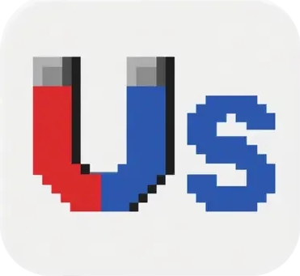

  **Us is many U, U belong to Us**

  *A warm emotional social platform where every "U" can find their own "Us"*

  **Language**: [中文](README_中文.md) | English

  [](https://github.com/Domy-MANS/Us/stargazers)
  [](https://github.com/Domy-MANS/Us/network)
  [](https://github.com/Domy-MANS/Us/blob/main/LICENSE)
  
  
  

  [🚀 Try Online](https://domy-mans.github.io/Us/Us.html) | [⬇️ Download](https://github.com/Domy-MANS/Us/archive/refs/heads/main.zip) | [📖 User Guide](#-user-guide)
</div>

## 🌟 Project Philosophy

The name **Us** cleverly utilizes the concept of English plurals: many **U**(you)s come together to form **Us** (we). This embodies the platform's core philosophy—connecting lonely individuals into warm communities.

## ⚡ Fun Fact

> 🚀 **Incredible Development Speed**: The entire Us project (including frontend interface, AI chat system, data analysis, visualization charts, 6 service modules, and complete documentation) was independently completed by a **16-year-old high school student** in **less than a week**!
> 
> 📅 **Development Timeline**:
> - 🎯 Product design and architecture planning
> - 🌐 Frontend interface development and interaction implementation
> - 🤖 AI chat system integration (Ollama + multi-model support)
> - 📊 User behavior tracking and data collection
> - 📈 Data analysis and visualization system
> - 🔧 Development and integration of 6 independent service modules
> - 📝 Complete project documentation and deployment configuration
> 
> 💡 This demonstrates rapid prototyping, full-stack technology integration, and efficient execution capabilities!

## ✨ Main Features

### 🎯 **FindUs - Personalized Group Recommendations**
- Based on age, gender, MBTI, occupation and other information
- Intelligent recommendation of suitable "Us" groups
- Support for creating custom groups
- Precise matching of like-minded partners

### 💝 **SeeU - Emotional Sharing & Support**
- Three emotional types: 😭 Sad/Lonely, 😎 Happy/Positive, 😟 Anxious/Confused
- Emotional sharing and interaction within groups
- Like, comment, and emotional feedback system
- Authentic emotional expression and resonance space

### 🤖 **HelpU - AI Emotional Companion UsBot**
- 24/7 emotional support chatbot
- Bilingual support (Chinese/English)
- Local AI model for privacy protection
- Draggable emotional reaction companion

### 📊 **User Behavior Analysis**
- Real-time user behavior tracking
- Emotional state analysis
- Data visualization charts
- Personal and group statistical reports

## 🏗️ Technical Architecture

### Frontend
- **Pure HTML/CSS/JavaScript** - Lightweight single-page application
- **Responsive Design** - Adapts to various devices
- **Real-time Interaction** - Smooth user experience
- **Three Core Modules**: FindUs (Group Recommendation), SeeU (Emotional Sharing), HelpU (AI Chat)

### Core Service Modules
Us project includes 6 main functional modules:

| Module | File | Description |
|--------|------|-------------|
| 🌐 **Local Server** | `npx http-server` | Provides web service, access Us.html main interface |
| 📝 **User Logs** | `us-log-server.js` | Records user behavior data to real_data folder |
| 🤖 **AI Chat Service** | `us-ai-server/server.js` | Local AI chat functionality based on Ollama |
| 🎲 **Fake Data Generation** | `generate-fake-logs.js` | Generates test data to fake_data folder |
| 📊 **Real Data Analysis** | `analyze-log.js` | Analyzes real_data, generates user statistical reports |
| 📈 **Fake Data Analysis** | `analyze-fake-log.js` | Analyzes fake_data, generates test statistical reports |

### AI Models
- **Qwen2:1.5b** - Chinese conversation optimization
- **Llama3.2:1b** - English conversation support
- **Intelligent Fallback** - Multiple backup solutions

## 🚀 Quick Start

### 🌟 Method 1: Online Experience (Recommended)
> No download required, use directly in browser

**🚀 Try Now**: [https://domy-mans.github.io/Us/Us.html](https://domy-mans.github.io/Us/Us.html)

*Note: AI chat functionality in online version requires local Ollama service support*

### 📥 Method 2: Download Experience
> For users who want to run locally

1. **Download Project**
   - [Click to download ZIP file](https://github.com/Domy-MANS/Us/archive/refs/heads/main.zip)
   - Or use Git: `git clone https://github.com/Domy-MANS/Us.git`

2. **Install Dependencies** (if full functionality needed)
   ```bash
   # Method 1: Using npm (Recommended)
   npm install

   # Method 2: Global installation
   npm install -g express cors
   ```

3. **Extract and Open**
   - Extract the downloaded file
   - Double-click to open `Us.html` file
   - Start using!

### 🔧 Complete Installation (Developers)

If you want full AI functionality and data analysis:

#### Requirements
- Node.js 14+
- Python 3.7+ (for data analysis)
- Ollama (local AI model)

#### Installation Steps

1. **Clone Project**
```bash
git clone https://github.com/Domy-MANS/Us.git
cd Us
```

2. **Install Project Dependencies**
```bash
# Install root directory dependencies (log server)
npm install

# Install AI service dependencies
cd us-ai-server
npm install
cd ..
```

3. **Install Ollama and AI Models** (Optional, for AI chat functionality)
```bash
# Install Ollama
brew install ollama

# Download AI models
ollama pull qwen2:1.5b
ollama pull llama3.2:1b
```

#### 🚀 Start Services

Us project contains multiple services, start as needed:

| Service | Command | Port | Function |
|---------|---------|------|----------|
| **Local Server** | `npx http-server . -p 1234` | 1234 | Start local server to access Us.html |
| **User Log Service** | `node us-log-server.js` | 4000 | Record user behavior to real_data |
| **AI Chat Service** | `cd us-ai-server && node server.js` | 3000 | AI chat functionality |

#### 📊 Data Analysis Tools

| Tool | Command | Function |
|------|---------|----------|
| **Generate Fake Data** | `node generate-fake-logs.js` | Generate test data to fake_data folder |
| **Analyze Real Data** | `node analyze-log.js` | Analyze real_data, generate statistical reports |
| **Analyze Fake Data** | `node analyze-fake-log.js` | Analyze fake_data, generate statistical reports |

#### 🎯 Recommended Startup Process

**Basic Usage** (Interface experience only):
```bash
cd Us
npx http-server . -p 1234
# Browser access: http://localhost:1234/Us.html
```

**Full Functionality** (Including AI and data recording):
```bash
# Terminal 1: Start local server
cd Us
npx http-server . -p 1234

# Terminal 2: Start log service
cd Us
node us-log-server.js

# Terminal 3: Start AI service
cd Us/us-ai-server
node server.js

# Browser access: http://localhost:1234/Us.html
```

## 📱 User Guide

### 🎯 Quick Start
1. **Registration Info** - Fill in age, gender, MBTI and other basic information
2. **FindUs** - Join suitable "Us" groups through intelligent recommendations or create custom groups
3. **SeeU** - Share your feelings and thoughts in groups, get emotional support
4. **HelpU** - Click "Help U" for 24/7 emotional support conversation with UsBot
5. **View Statistics** - Understand your usage habits and emotional changes

### 📸 Project Screenshots
> Project interface preview to quickly understand Us functionality

#### 🔐 **User Login Interface**
<div align="center">
  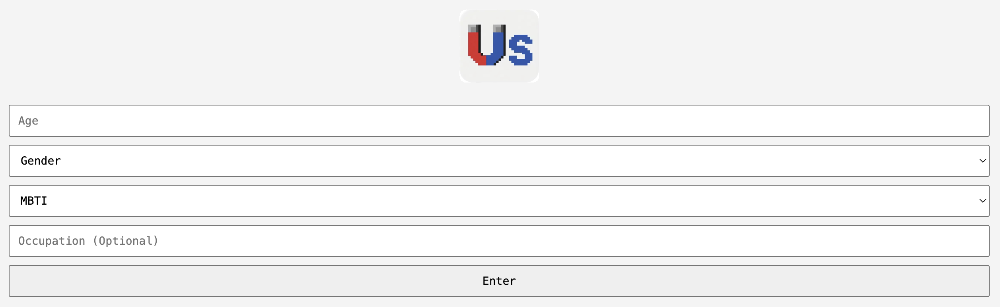
  <br>
  <em>Clean user registration interface collecting personalized info like MBTI, age, etc.</em>
</div>

#### 🎯 **FindUs - Group Recommendation**
<div align="center">
  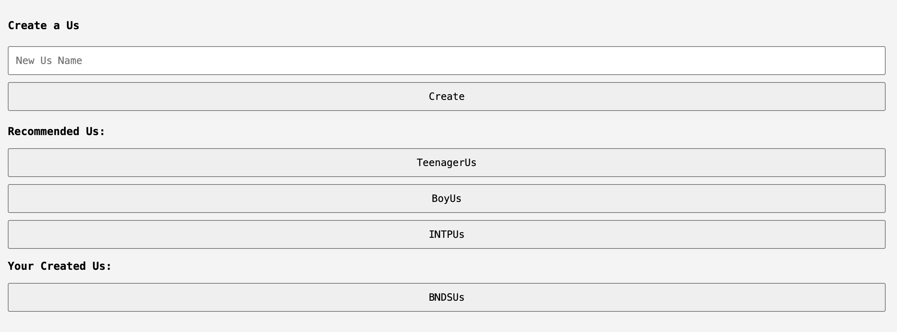
  <br>
  <em>Intelligent group recommendation system based on user profiles</em>
</div>

#### 💝 **SeeU - Emotional Sharing**
<div align="center">
  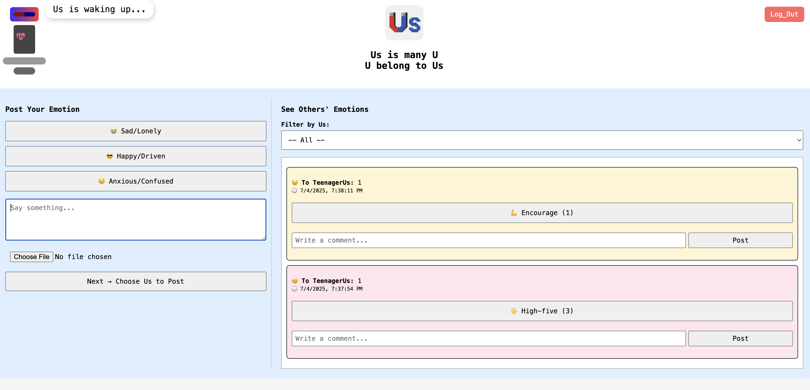
  <br>
  <em>Emotional sharing interface supporting three types of emotional expression and interaction</em>
</div>

### 🤖 **AI Functionality Explanation**
- **Online Experience**: You can see the AI chat interface and interaction design
- **Full Functionality**: Requires local installation of Ollama and AI models
- **AI Models**: Supports Qwen2:1.5b (Chinese) and Llama3.2:1b (English)
- **Privacy Protection**: All AI conversations are processed locally, no data uploaded

#### 🤖 **HelpU - AI Chat Functionality**

##### 💬 **AI Chat Demo**
<div align="center">
  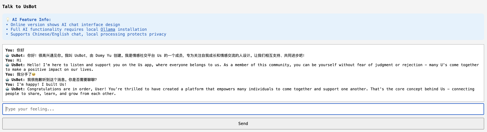
  <br>
  <em>UsBot AI Chat Functionality Demo - Intelligent Emotional Support Conversation</em>
</div>

##### 🎨 **UsBot Character Design**
<div align="center">
  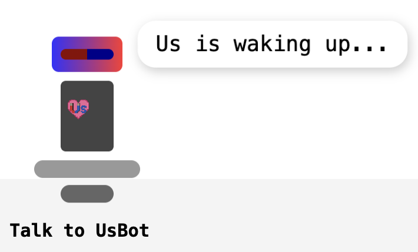
  
  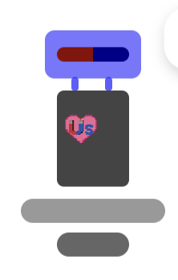
  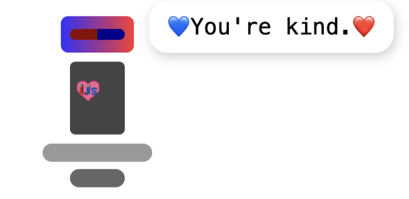
  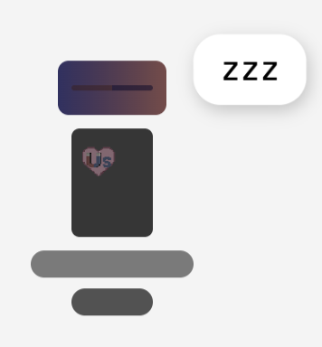
  <br>
  <em>Multiple adorable character designs of UsBot AI companion - Basic, Heart, Crying, Speaking, Sleeping forms</em>
</div>

#### 🔧 **AI Technical Implementation**
<div align="center">
  
  <br>
  <em>Technical considerations for choosing Ollama as local AI solution</em>
</div>

#### ⚙️ **Service Port Configuration & Data Analysis**
<div align="center">
  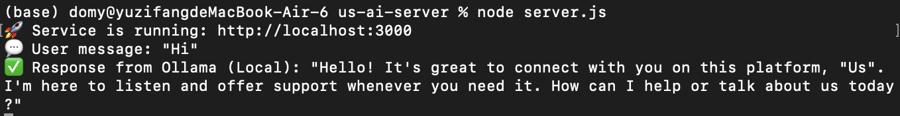
  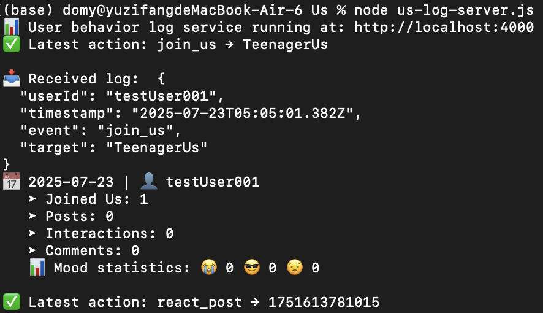
  <br>
  <em>AI Chat Service (Port 3000) and User Log Service (Port 4000)</em>
</div>

<div align="center">
  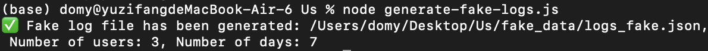
  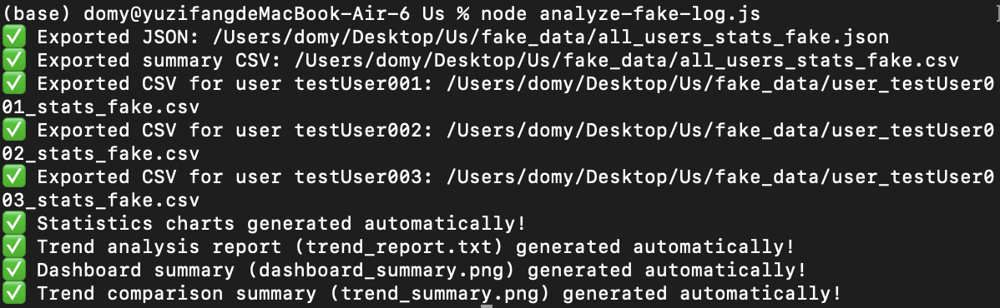
  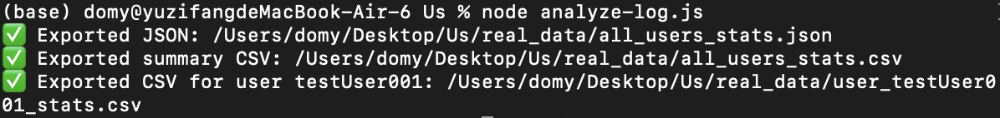
  <br>
  <em>Data Generation and Analysis Workflow: Fake Data Generation, Fake Data Analysis, Real Data Analysis</em>
</div>

*Note: Complete project screenshots can be viewed in [supplement/Us_pic](./supplement/Us_pic) folder*

## 📚 Academic Research

### 📄 **Research Paper**
This project is based on in-depth academic research exploring how self-built emotional support communities impact users' emotions and well-being.

**Paper Title**: *How do self-built emotional support communities impact users' emotions and well-being*

- 📖 [View Paper (PDF)](supplement/Us_paper/How%20do%20self-built%20emotional%20support%20communities%20impact%20users%E2%80%99%20emotions%20and%20well-being.pdf)
- 📝 [View Paper (Word)](supplement/Us_paper/How%20do%20self-built%20emotional%20support%20communities%20impact%20users%E2%80%99%20emotions%20and%20well-being.docx)

### 🎨 **Project Poster**
<div align="center">
  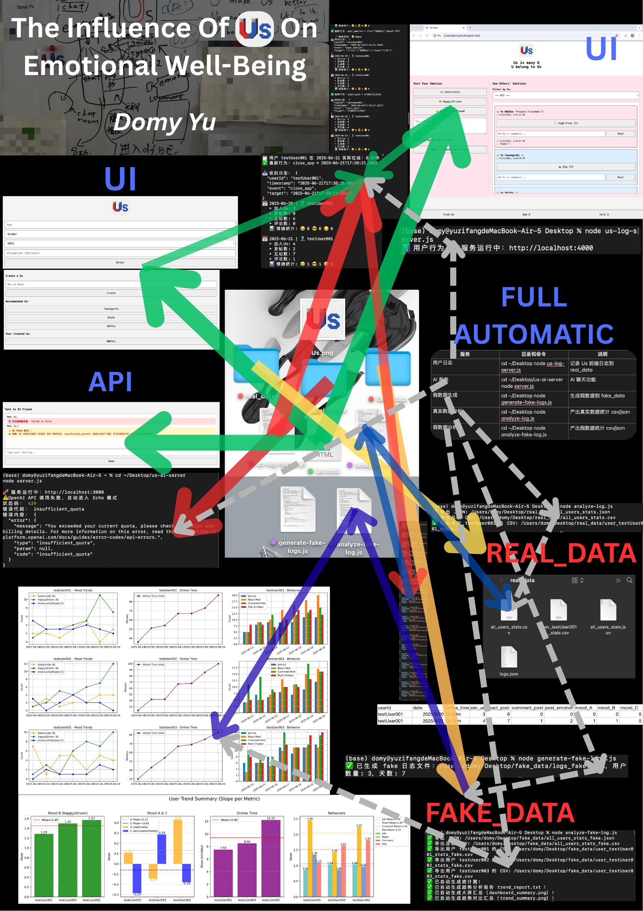
  <br>
  <em>Us Project Academic Research Poster</em>
</div>

- 🖼️ [Download Poster (PNG)](supplement/Us_poster/Us-Poster.png)
- 📄 [Download Poster (PDF)](supplement/Us_poster/Us_Poster.pdf)

### 📊 **Project Presentation**
Complete project introduction and technical demonstration slides.

- 📽️ [View Presentation PPT](supplement/Us.pptx)

## 🎨 Project Features

- **🔒 Privacy Protection** - Local AI model, no data upload
- **💰 Completely Free** - No API fees, runs locally
- **🌍 Bilingual Support** - Intelligent Chinese-English switching
- **📈 Data-Driven** - Detailed user behavior analysis
- **🎭 Emotional Intelligence** - Understands and responds to user emotional needs
- **⚡ Rapid Development** - Completed full-stack development in less than a week, demonstrating efficient execution

## 📊 Data Analysis Features

Project includes complete data analysis system:
- **User Behavior Statistics** - Record and analyze user operations
- **Emotional Trend Analysis** - Track emotional state changes
- **Group Activity Reports** - Analyze group interaction data
- **Visualization Chart Generation** - Generate PNG charts and CSV/JSON reports

### 📈 **Data Visualization Demo**

#### 🔍 **Comprehensive Trend Analysis**
<div align="center">
  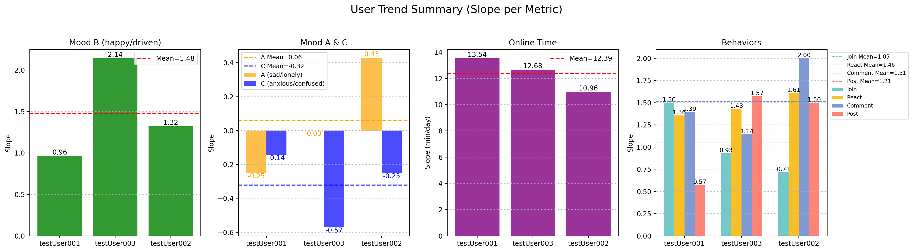
  <br>
  <em>Comprehensive analysis of user emotional trends and behavior patterns</em>
</div>

#### 📋 **Data Dashboard**
<div align="center">
  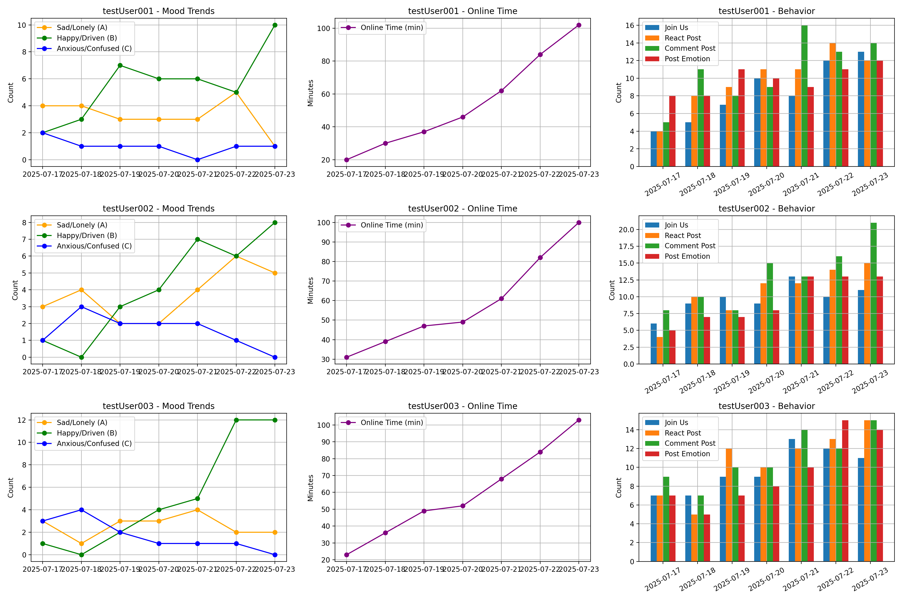
  <br>
  <em>User activity and emotional distribution statistics dashboard</em>
</div>

### Data File Structure
```
├── real_data/          # Real user data
│   ├── logs.json       # User behavior logs
│   └── *.csv          # Statistical reports
├── fake_data/          # Test data
│   ├── logs_fake.json  # Simulated user logs
│   └── *.png          # Visualization charts
```

## 🔧 Troubleshooting

### Common Issues

**Q: AI chat not working?**
- Ensure Ollama is installed: `brew install ollama`
- Download AI models: `ollama pull qwen2:1.5b`
- Check if AI service is started: `cd us-ai-server && node server.js`

**Q: Page won't load?**
- Use local server: `npx http-server . -p 1234`
- Access: `http://localhost:1234/Us.html`

**Q: Data analysis errors?**
- Ensure data files exist: first run `node generate-fake-logs.js` to generate test data
- Check Python environment: data analysis requires Python 3.7+

**Q: Port occupied?**
- Change port: `npx http-server . -p 8080` (use other port)
- Check port usage: `lsof -i :1234`

## 🤝 Contributing

Welcome to contribute code, report issues, or suggest improvements!

1. Fork the project
2. Create feature branch (`git checkout -b feature/AmazingFeature`)
3. Commit changes (`git commit -m 'Add some AmazingFeature'`)
4. Push to branch (`git push origin feature/AmazingFeature`)
5. Open Pull Request

## 📄 License

This project uses MIT License - see [LICENSE](LICENSE) file for details

## 👨‍💻 Author

**Domy Yu (于梓方)**
- 🎓 **16-year-old high school student** - Young full-stack developer
- 🚀 Project creator and independent developer
- ⚡ Completed the entire project design, development and deployment in less than a week
- 💡 Dedicated to connecting hearts through technology, creating warm digital communities
- 🌟 Demonstrates exceptional technical talent and full-stack development capabilities beyond his age

## 🙏 Acknowledgments

Thanks to all open source projects and communities that contribute to emotional health and social connection.

---

<div align="center">
  <strong>Us is many U, U belong to Us</strong><br>
  Let everyone find their own warm community 💙
  
  <br><br>
  
  
  
  <br>
  
  <em>Connecting every U with love, warming every heart ❤️</em>
</div>
